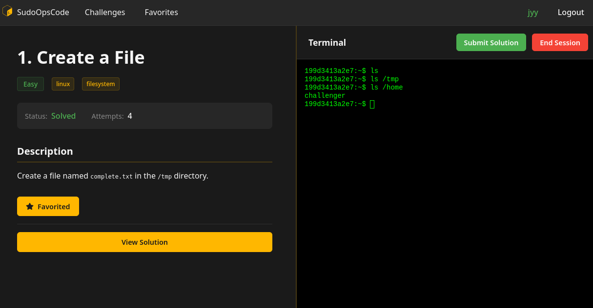
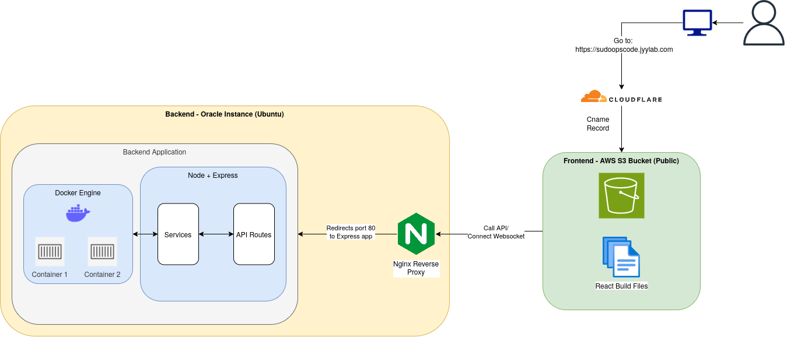

# SudoOpsCode

Basically Leetcode for Linux admin. Platform for solving Linux/DevOps challenges inside Docker containers on the web browser.

Frontend uses React + Vite + TS + CSS.

Backend uses Node + Express to manage challenge sessions, Docker containers, and user progress. SQLite used for database to store user info and Docker for providing isolated Linux environments for each challenge session, interacted through websockets.

## Preview



## Setup

Tested on Linux host.

### Requirements

Ensure system has Docker and NodeJS installed.

### Docker Setup

**Important**: First need to build the actual base Docker image that is used for each container. Run:

``` bash
docker build -f backend/challenges/Dockerfile.challenge -t challenge-runner:v1.0 .
```

This is the Docker image used for each container that corresponds to a terminal session. Without it backend may error out.

### Backend Setup

By default, this starts the Express server on port 3008 (also set in frontend). You can create `.env` and set environment variables listed in `backend/config/index.ts`.

``` bash
cd backend
npm run build
npm run dev

# for running unit tests
npm run test
```

### Frontend Setup

``` bash
cd frontend
npm install
npm run dev
```

By default, the frontend uses localhost:3008 as the API base URL. To change, create `.env` in `frontend` and can change to something like:

``` conf
VITE_API_BASE_URL=http://localhost:3009
VITE_WS_BASE_URL=ws://localhost:3009
```

## Non-local Deployment

For non-local deployment, I used Cloudflare as my DNS provider and CDN, AWS S3 to host frontend, Oracle Instance to host backend (API + database). Basically use Terraform to create public S3 bucket w/ Cloudflare domain pointing to bucket (cname), sync static frontend files to bucket, backend do manual deploy (could automate w/ Terraform + bash, possible todo).

Full instructions on free [setup](./docs/application_deployment.md)

## Tech Stack

### Frontend

- React + Typescript + Vite
- React Router for routing
- Zustand for state management (eg. user token)
- CSS for styling
- Xtermjs for terminal connection
- React Markdown for rendering markdown

### Backend

- Node + Expressjs + Typescript
- SQLite3 as database
- Sequelize as ORM to interact w/ db
- Pino for logging
- Jest for unit testing
- JWT for auth
- Dockerode for interfacing Docker API w/ Node
- Websocket for connecting to terminal session live

### "Prod" Deployment

- AWS S3 for frontend
- Oracle Instance for backend (manual setup)
- Cloudflare for CDN, DNS provider
- Terraform for IaC (only for frontend)

## Hosting Diagram



## More Documentation

See [docs](./docs/README.md) for some more notes about project.
