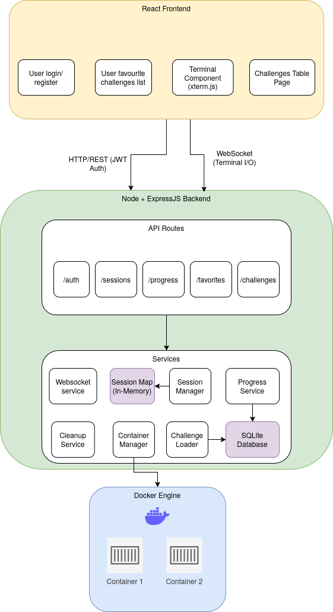
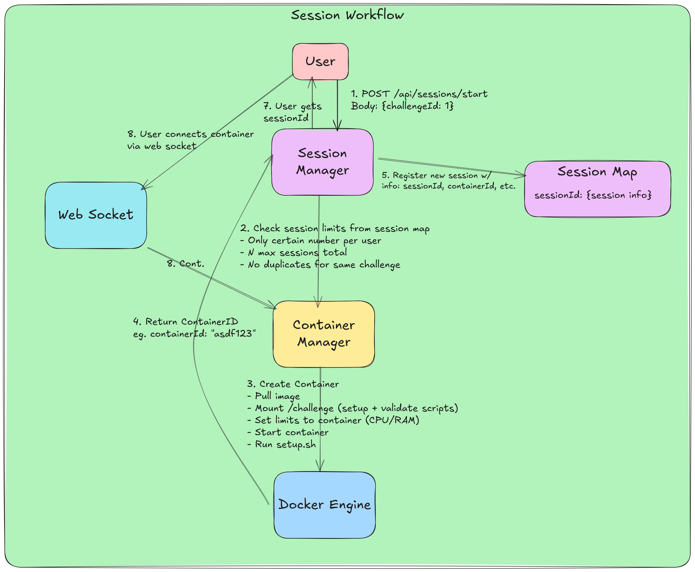
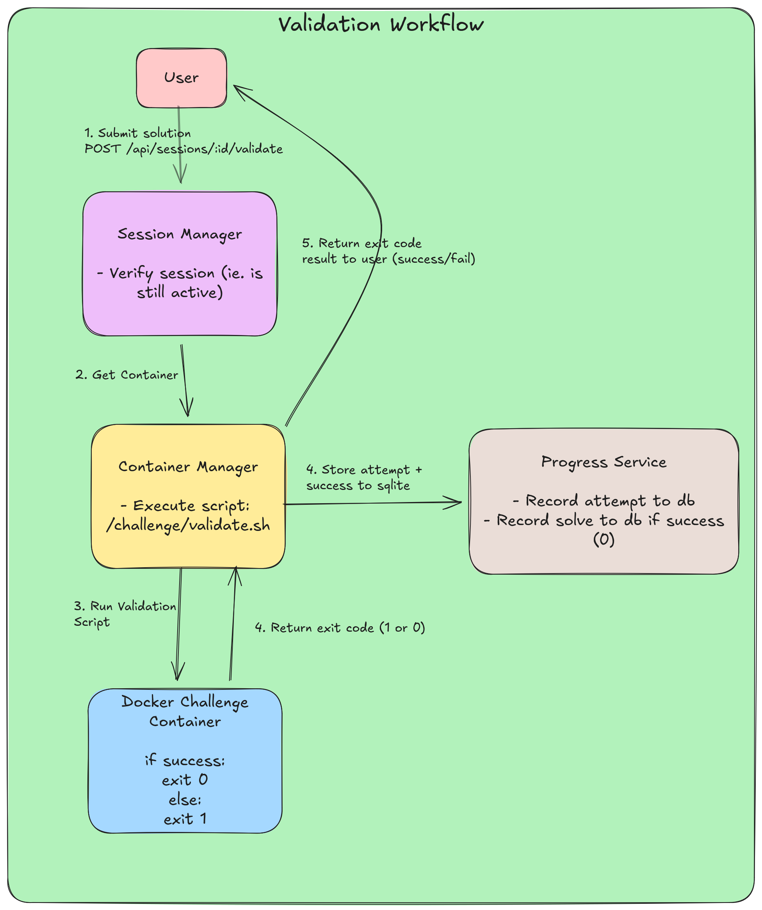
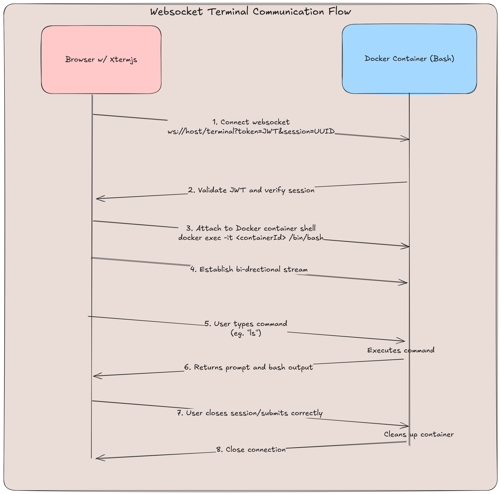

# Backend Documentation

## Overview

The backend is a Node.js + Express + TypeScript application that manages challenge sessions, Docker containers, and user progress. It uses SQLite for data persistence and Docker for providing isolated Linux environments for each challenge session.



## Key Parts

### 1. Session & Container Management Workflow

The core workflow involves creating isolated Docker environments for users to solve challenges:

``` txt
User Request → Session Creation → Container Provisioning → WebSocket Connection → Terminal Interaction → Validation → Cleanup
```

#### Diagram



### 2. Cleanups

Background job runs periodically (`cleanupJob.ts`):

``` txt
Check expired sessions → Stop containers → Remove sessions → Log cleanup
```

- Identifies stale sessions (past expiration)
- Stops and removes associated Docker containers
- Removes session records from memory
- Prevents resource leaks

### 3. Challenge Loader

Each challenge is declartively defined, where each directory inside the `challenges` folder represent a single challenge. Within in each challenge folder, we have:

- `challenge.yaml` for metadata
- `setup.sh` (optional) for setup resources inside container
- `validate.sh` to verify user solution (runs when user submits)

The challenges directory looks something like:

``` bash
challenges/
├── 001-create-file
│   ├── challenge.yaml
│   └── validate.sh
├── 002-kill-unwanted-process
│   ├── challenge.yaml
│   ├── setup.sh
│   └── validate.sh
```

Upon backend startup, we traverse through this directory, loading each `challenge.yaml` metadata into the database. When a challenge container is started, we mount the scripts.

### 4. Validation Workflow



### 5. Websocket Terminal Communication

