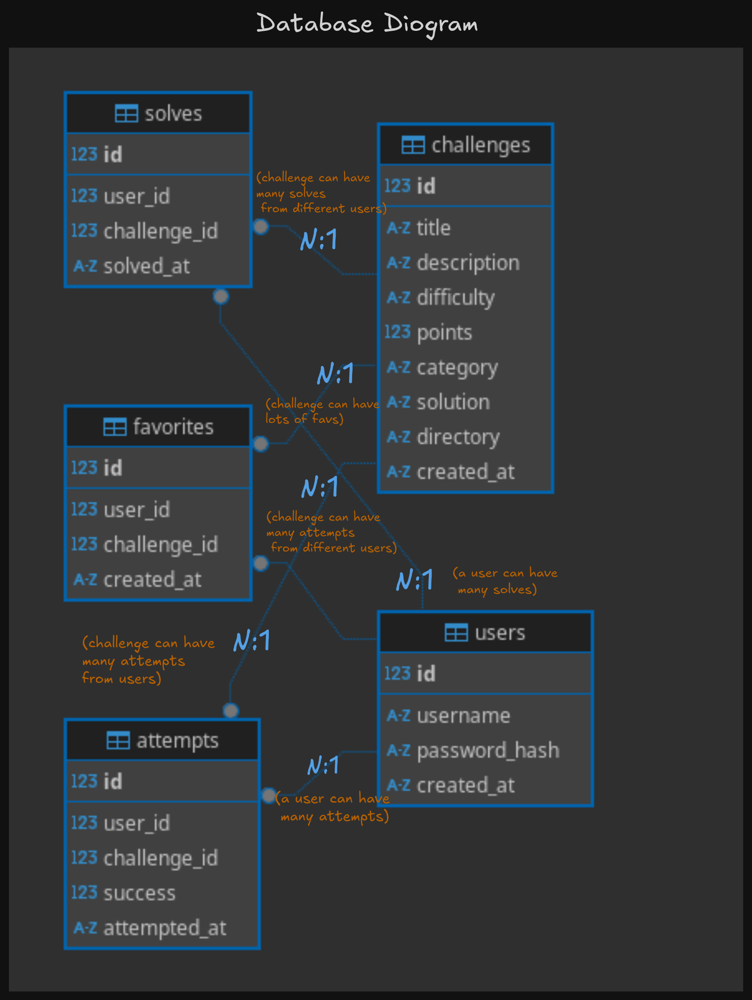

# Database Schema

## Diagram



## Tables

### users
- Stores user accounts and authentication
- Primary key: `id`
- Unique constraint: `username`
- Indexed: `username` (for login lookups)

### challenges
- Stores CTF challenge definitions
- Primary key: `id`
- Unique constraint: `directory` (filesystem path to challenge files)
- Indexed: `difficulty`, `category`, `directory`
- Constraint: `difficulty` must be 'easy', 'medium', or 'hard'

### attempts
- Records **every** flag submission attempt (both successful and failed)
- Primary key: `id`
- Foreign keys: `user_id` → users, `challenge_id` → challenges
- Indexed: `user_id`, `challenge_id`, `success`
- No unique constraint (same user can attempt same challenge multiple times)

### solves
- Records **first successful solve** per user per challenge
- Primary key: `id`
- Foreign keys: `user_id` → users, `challenge_id` → challenges
- **Unique constraint: `(user_id, challenge_id)` - prevents duplicate solves**
- Indexed: `user_id`, `challenge_id`, `solved_at`
- Denormalized for leaderboard performance

### favorites
- Stores user's favorited/bookmarked challenges
- Primary key: `id`
- Foreign keys: `user_id` → users, `challenge_id` → challenges
- **Unique constraint: `(user_id, challenge_id)` - user can only favorite each challenge once**
- Indexed: `user_id`, `challenge_id`

---

## Key Relationships

- **users ↔ attempts**: One-to-many (a user can have many attempts)
- **users ↔ solves**: One-to-many (a user can have many solves, one per challenge)
- **users ↔ favorites**: One-to-many (a user can favorite many challenges)
- **challenges ↔ attempts**: One-to-many (a challenge can have many attempts from different users)
- **challenges ↔ solves**: One-to-many (a challenge can be solved by many users)
- **challenges ↔ favorites**: One-to-many (a challenge can be favorited by many users)

**Note:** The relationship between users and challenges is **many-to-many** through three junction tables:
- `attempts` (tracks all submission attempts)
- `solves` (tracks successful completions)
- `favorites` (tracks user bookmarks)

---

## Design Decisions

### Why separate `attempts` and `solves` tables?

Record attemps for every submission, solves only on successfully completion. Allows for better analytics and leaderboard integration in the future.

#### Why not just use `attempts WHERE success = TRUE`?

- Performance: Querying `solves` is O(n) vs filtering `attempts` is O(n log n)
- Data integrity: UNIQUE constraint prevents bugs (can't accidentally record same solve twice)

### No sessions table

Sessions are **ephemeral** and stored **in-memory**:

- Stored in `SessionManager` (Node.js application memory)
- No need to persist to database (containers are stateless/temporary)
- Sessions expire after timeout or explicit logout
- If server restarts, users just need to log in again (acceptable tradeoff)

**Why in-memory?**

- Faster lookup (no disk I/O)
- Simpler code (no DB queries on every request)
- Less write operations to DB

### Index Strategy

Indexes are created on **commonly queried fields**:

#### Users

- `username` - for login lookups (`WHERE username = ?`)

#### Challenges

- `difficulty` - for filtering challenges by difficulty
- `category` - for filtering challenges by category
- `directory` - for looking up challenges by filesystem path

#### Attempts

- `user_id` - for user attempt history
- `challenge_id` - for challenge attempt analytics
- `success` - for filtering successful attempts

#### Solves

- `user_id` - for user scoreboard/profile
- `challenge_id` - for challenge solver list
- `solved_at` - for leaderboard ordering (first blood rankings)

#### Favorites

- `user_id` - for fetching user's favorite challenges
- `challenge_id` - for showing how many users favorited a challenge

#### Trade-off

Indexes speed up reads but slow down writes. Since this platform is read-heavy, indexes improve performance.

## SQLite-Specific Optimizations

### WAL Mode (Write-Ahead Logging)

```sql
PRAGMA journal_mode = WAL;
```

- Better concurrency
- Generally faster in most scenarios

### FK Constraints

- Ensure referential integrity (cascading deletes, parent deleted children deleted)
- Eg. user deleted, favorites deleted
